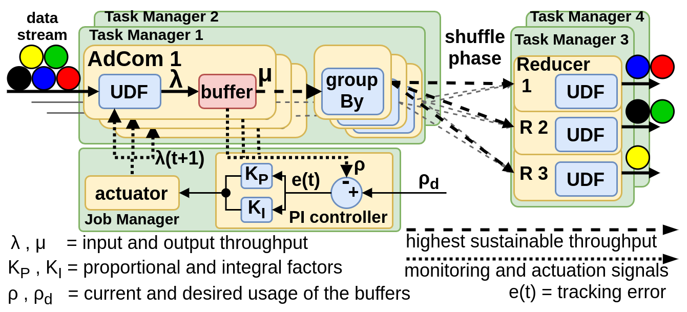

# AdCom: Adaptive Combiner for Streaming Aggregations

Continuous applications such as device monitoring and anomaly detection often require real-time aggregated statistics over unbounded data streams. While existing stream processing systems such as Flink, Spark, and Storm support processing of streaming aggregations, their optimizations are limited with respect to the dynamic nature of the data, and therefore are suboptimal when the workload changes and/or when there is data skew. In this paper, we present AdCom, which is an adaptive combiner for stream processing engines. The use of AdCom in aggregation queries enables pre-aggregating tuples upstream (i.e., before data shuffling) followed by global aggregation downstream. In contrast to existing approaches, AdCom can automatically adjust the number of tuples to pre-aggregate depending on the data rate and available network. Our experimental study using real-world streaming workloads shows that using AdCom leads to 2.5--9x higher sustainable throughput without compromising latency.

 - paper link: [https://edbt2021proceedings.github.io/docs/p266.pdf](https://edbt2021proceedings.github.io/docs/p266.pdf)



## Description

This is an [Apache Flink](https://github.com/apache/flink) branch forked from the original repository of Apache Flink version 1.11.2 which has an adaptive combiner (AdCom) for stream aggregations.

## Quick start

One can use AdCom by calling the operator `adCombine(PreAggregateFunction())` which starts AdCom with `500 milliseconds` and adapts the pre-aggregation during runtime. A static combine is also available by calling the `combine(PreAggregateFunction(), time in milliseconds)` operator which pre-aggregates win window times passed as parameter. Some examples of queries using AdCom can be found at the [AdCom module](flink-adcom/src/main/java/org/apache/flink/streaming/examples/aggregate).

### Using the adaptive combiner with the proportional-integral (PI) controller
```
StreamExecutionEnvironment env = StreamExecutionEnvironment.getExecutionEnvironment();

PreAggregateFunction taxiRidePreAggregateFunction = new TaxiRideCountPreAggregateFunction();

env.addSource(new TaxiRideSource())
        .adCombine(taxiRidePreAggregateFunction)
        .keyBy(new TaxiRideKeySelector())
        .reduce(new TaxiRideSumReduceFunction())
        .print();
```
### Using the static combiner
```
StreamExecutionEnvironment env = StreamExecutionEnvironment.getExecutionEnvironment();

PreAggregateFunction taxiRidePreAggregateFunction = new TaxiRideCountPreAggregateFunction();

env.addSource(new TaxiRideSource())
        .combine(taxiRidePreAggregateFunction, 3 seconds)
        .keyBy(new TaxiRideKeySelector())
        .reduce(new TaxiRideSumReduceFunction())
        .print();
```

## Compiling

The `adCombine` and `combine` transformations are not in the Flink original distribution. This is the project where you can use these operators. Hence, it is necessary to compile this Flink+AdCom distribution (forked from Flink original) to be able to use AdCom. It is necessary to compile the whole project at least once because AdCom is a new operator that one can call from the Flink `StreamExecutionEnvironment`.
```
$ mvn clean install -e -X -DskipTests -Dskip.npm -Dmaven.javadoc.skip=true -Dcheckstyle.skip=true -Drat.skip=true -Dscala-2.12
// or ...
$ mvn clean install -DskipTests -Dfast -Dscala-2.12
```
After you compiled the project you can create yours own data stream queries on the `flink-adcom` module and compile only this project
```
$ mvn clean install -DskipTests -Dfast -Dscala-2.12 -rf :flink-adcom_2.12
```

## Deploying Flink+AdCom

Make sure that an original Flink 1.11.2 is deployed and running as a stand-alone cluster. Then, stop this Flink cluster and replace the distribution libraries created after compiling the Flink+AdCom project. You have to replace the following libraries:
```
cp /home/user/workspace-idea/AdCom/flink-dist/target/flink-1.12-SNAPSHOT-bin/flink-1.12-SNAPSHOT/lib/flink-csv-1.12-SNAPSHOT.jar /home/user/original-flink/lib/flink-csv-1.11.2.jar
cp /home/user/workspace-idea/AdCom/flink-dist/target/flink-1.12-SNAPSHOT-bin/flink-1.12-SNAPSHOT/lib/flink-dist_2.12-1.12-SNAPSHOT.jar /home/user/original-flink/lib/flink-dist_2.12-1.11.2.jar
cp /home/user/workspace-idea/AdCom/flink-dist/target/flink-1.12-SNAPSHOT-bin/flink-1.12-SNAPSHOT/lib/flink-json-1.12-SNAPSHOT.jar /home/user/original-flink/lib/flink-json-1.11.2.jar
cp /home/user/workspace-idea/AdCom/flink-dist/target/flink-1.12-SNAPSHOT-bin/flink-1.12-SNAPSHOT/lib/flink-shaded-zookeeper-3.4.14.jar /home/user/original-flink/lib/flink-shaded-zookeeper-3.4.14.jar
cp /home/user/workspace-idea/AdCom/flink-dist/target/flink-1.12-SNAPSHOT-bin/flink-1.12-SNAPSHOT/lib/flink-table-blink_2.12-1.12-SNAPSHOT.jar /home/user/original-flink/lib/flink-table-blink_2.12-1.11.2.jar
cp /home/user/workspace-idea/AdCom/flink-dist/target/flink-1.12-SNAPSHOT-bin/flink-1.12-SNAPSHOT/lib/flink-table_2.12-1.12-SNAPSHOT.jar /home/user/original-flink/lib/flink-table_2.12-1.11.2.jar
```
Additionally to the standard libraries, it is also necessary to use other libraries if you want to export metrics to Prometheus and visualize at it Grafana dashboard. There is also a TPCH-benchmark library that facilitates the use of TPCH-queries and some other libraries that I was measuring the CPU usage of queries.
```
flink-metrics-dropwizard-1.11.2.jar
flink-metrics-prometheus_2.12-1.11.2.jar
joda-time-2.5.jar
metrics-core-4.1.0.jar
mqtt-client-1.15.jar
oshi-core-3.4.0.jar
tpch-0.10.jar
```
Install the MQTT broker on the nodes of the cluster:
```
sudo apt install mosquitto
sudo apt install mosquitto-clients
```
Configure the metrics reporter by adding the following lines in the `flink+adcom/conf/flink-conf.yaml` file.
```
# Metrics Reporter
metrics.reporter.prom.class: org.apache.flink.metrics.prometheus.PrometheusReporter
metrics.reporter.prom.host: 127.0.0.1
metrics.reporter.prom.port: 9250-9260
```
Restart the cluster and run a simple word-count application to verify if it is working.

## Pre-built stream applications 

There are some applications already created on the [AdCom module](flink-adcom/src/main/java/org/apache/flink/streaming/examples/aggregate) module that one can use. When you compile the project it will generate jar files of those applications at `/home/user/workspace-idea/AdCom/flink-adcom/flink-examples/flink-examples-streaming/target/`.

### Configuring the workload

Configure the workload file that the data source will read using its complete path on the file `/tmp/workloadFile.txt`. We decided to not pass the path of the file during the `./bin/flink run` command because using parallel data sources we can change one source to consume a file with skewed workload, and then change back to the file with normalized workload.

```
# echo "/home/flink/flink-worloads/nycTaxiRides.gz" > /tmp/workloadFile.txt
```

We proved that AdCom can adapt to workload variation by changing the data rate of the workflow (of course =). The pre-built applications have source operators that can adapt those changes. You just have to create a file at `/tmp/datarate.txt` which contains the time in nanoseconds that an infinite loop emmit triggers on the source operators. If you monitor the throughput of AdCom when you change the workload data rate, you will see that AdCom adapts itself to the highest and sustainable throughput. For instance, running one data source operator with no parallel instances use these configurations:
```
# Changing the data rate for 1 data source
# echo '1000000000' > /tmp/datarate.txt    # 1    rec/sec
# echo '10000000' > /tmp/datarate.txt      # 100  rec/sec
# echo '2000000' > /tmp/datarate.txt       # 500  rec/sec
# echo '1000000' > /tmp/datarate.txt       # 1K   rec/sec
# echo '200000' > /tmp/datarate.txt        # 5K   rec/sec
# echo '100000' > /tmp/datarate.txt        # 10K  rec/sec
# echo '66666' > /tmp/datarate.txt         # 15K  rec/sec
# echo '50000' > /tmp/datarate.txt         # 20K  rec/sec
# echo '20000' > /tmp/datarate.txt         # 50K  rec/sec
# echo '10000' > /tmp/datarate.txt         # 100K rec/sec
# echo '5000' > /tmp/datarate.txt          # 200K rec/sec
# echo '2000' > /tmp/datarate.txt          # 500K rec/sec
# echo '1000' > /tmp/datarate.txt          # 1M   rec/sec
# echo '500' > /tmp/datarate.txt           # 2M   rec/sec
```
Running one data source operator with 8 parallel instances

```
# echo '800000' > /tmp/datarate.txt        # 1.25K r/s total -> 10K  rec/sec
# echo '400000' > /tmp/datarate.txt        # 2.5K r/s  total -> 20K  rec/sec
# echo '160000' > /tmp/datarate.txt        # 6.25K r/s total -> 50K  rec/sec
# echo '80000' > /tmp/datarate.txt         # 12.5K r/s total -> 100K rec/sec
# echo '40000' > /tmp/datarate.txt         # 25K r/s   total -> 200K rec/sec
# echo '16000' > /tmp/datarate.txt         # 65.5K r/s total -> 500K rec/sec
```

### Running

You can run the taxi ride pre-aggregation count with the following command:

```
./bin/flink run flink-adcom_2.12-1.12-SNAPSHOT-TaxiRideCountPreAggregate.jar \
                 -controller true \
                 -pre-aggregate-window-timeout 500 \
                 -disableOperatorChaining true \
                 -input-par true \
                 -output mqtt -sinkHost XXX.XXX.XXX.XXX
```
 - `-controller true|false`: enables the use of AdCom or disable AdCom and allow to use a static combiner
 - `-pre-aggregate-window-timeout 500`: the initial time to pre-aggregate tuples
 - `-disableOperatorChaining true|false`: disable operation chaining so one can see the throughput only on AdCom
 - `-input /home/flink/nycTaxiRides.gz`: the input file to process
 - `-input-par true|false`: allow the use of parallel source operators
 - `-output mqtt|log|text`: selects where to send the output of the stream query
 - `-sinkHost`: is the IP used when `-output mqtt` was selected

## The AdCom operator

The AdCom operator is available on the Flink Task Managers and uses the Flink Job Manager to manage when to trigger a new parameter to pre-aggregate.

### The AdCom operator in the Task Managers

The AdCom operator is available from the StreamExecutionEnvironment class and one can find its method in the class [DataStream.java#1403](flink-streaming-java/src/main/java/org/apache/flink/streaming/api/datastream/DataStream.java#L1403). It uses the [PreAggregateProcTimeStreamOperator.java](flink-streaming-java/src/main/java/org/apache/flink/streaming/api/operators/PreAggregateProcTimeStreamOperator.java) operator that receives a [PreAggregateFunction](flink-core/src/main/java/org/apache/flink/api/common/functions/PreAggregateFunction.java), a KeySelector (default from original Flink), the initial time to pre-aggregate (intervalMs), and a boolean parameter enableController that enables the use of AdCom or stick to a static pre-aggregate operator. As you can see these classes are implemented on the [flink-streaming-java](flink-streaming-java) and [flink-core](flink-core) modules of Flink. They are used on the Flink Task Managers.

### The AdCom operator in the Job Manager

AdCom receives signals to decide when to change/adapt the pre-aggregation interval from the [PreAggregateControllerService](flink-runtime/src/main/java/org/apache/flink/runtime/controller/PreAggregateControllerService.java) which is started in the Job Manager through the class [JobManagerRunnerImpl](flink-runtime/src/main/java/org/apache/flink/runtime/jobmaster/JobManagerRunnerImpl.java#L147). As you can see, these classes are implemented in the `flink-runtime` module of the original Flink distribution.

## Troubleshooting


